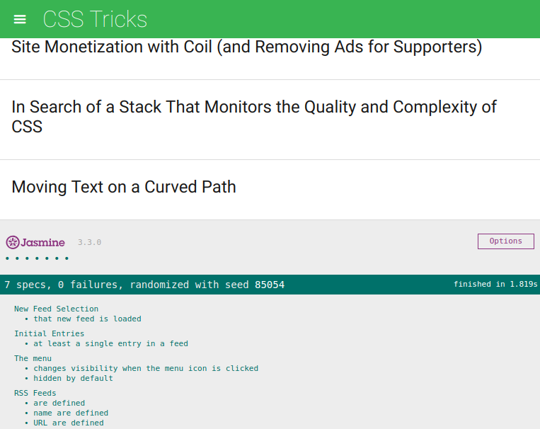

# Udacity FEND Feed Reader Testing

This project is from my Front-End Web Developer Nanodegree Program at Udacity. This project based on the concept of "test-driven development". Using the starter code given by Udacity, I tried to create a series of test suites for the Feed-reader application.

## Table of Contents

  - [Get Started](#get-started)
  - [Motivation](#motivation)
  - [Lesson Learned](#what-i-learned-from-this-project)
  - [Screenshot](#screenshot)
  - [Installation](#installation)
  - [How to Use?](#how-to-use?)
  - [Tests](#tests)
  - [Technology Used](#technology-used)
  - [Dependencies](#dependencies)
    - [Automation Tool](#automation-tool)
    - [Live Editing](#live-editing)
    - [CSS Optimization](#css-optimization)
    - [Javascript Optimization](#javascript-optimization)
    - [Unit Testing](#unit-testing)
  - [Contributing](#contributing)

## Get Started
Click on this [link]() to see the website or you can download or clone the project, and loading up the index.html file in your browser.

##  Motivation
Testing is an essential part of the development process and many organizations practice a standard of development known as "test-driven development". This is when developers write tests first before they ever start developing their application. All the tests initially fail, and then they start writing application code to make these tests pass.

Whether you work in an organization that uses test-driven development or in an organization that uses tests to make sure future feature development doesn't break existing features, it's an essential skill to have!

## What I learned from this project
In this project, I learned how to use Jasmine to write several tests against a pre-existing application. These tested the underlying business logic of the application as well as the event handling and DOM manipulation.

Good tests give you the ability to quickly analyze whether new code breaks an existing feature within your codebase, without having to test all of the functionality manually.

## Screenshot


## Installation
- You can download the zip or clone the project with git
  ```sh
  $ git clone https://github.com/abdsamadf/ud-fend-feed-reader-testing.git
  ```
- Install [Node.js](https://nodejs.org/)   by following the instructions on the website.
- Run `npm install --g gulp-cli`, to install gulp-cli.
- Run `npm install`, inside the project to install dependencies.
- Good Luck! :thumbsup:

## How to Use?
- cd {YOUR_PROJECT_DIRECTORY}
- Run `npm start`, to start the development.
- Run `npm test`, to run the unit test.
- Run `npm run build` to release the production to the world.

## Tests
1. A test that ensures the `allFeeds` variable has been defined and that it is not empty.
2. A test that loops through each feed in the `allFeeds` object and ensures `url` property has been defined and that the `name` is not empty.
3. A test that loops through each feed in the `allFeeds` object and ensures it has a `name` defined and that the `name` is not empty.
4. A test that ensures the menu element is hidden by default.
5. A test that ensures the menu changes visibility when the menu icon is clicked. This test has two expectations: does the menu display when clicked, and does it hide when clicked again?
6. A test that ensures when the `loadFeed` function is called and completes its work, there is at least a single `.entry` element within the `.feed` container.
7. A test that ensures when a new feed is loaded by the `loadFeed` function that the content actually changes.


## Technology Used
* HTML5 and CSS3
* Vanilla JS
* [jQuery](https://jquery.com) - jQuery is a JavaScript library designed to simplify HTML DOM tree traversal and manipulation, as well as event handling, CSS animation, and Ajax.
* Jasmine - [Jasmine](https://jasmine.github.io) is a Behavior Driven Development testing framework for JavaScript. It does not rely on browsers, DOM, or any JavaScript framework. Thus it's suited for websites, Node.js projects, or anywhere that JavaScript can run.
* Handlebars.js - [Handlebars](https://handlebarsjs.com) provides the power necessary to let you build semantic templates effectively with no frustration.

## Dependencies
* [Node.js](https://nodejs.org/en/)
* [cross-env](https://www.npmjs.com/package/cross-env)
* [gulp-watch](https://www.npmjs.com/package/gulp-watch)
* [gulp-sourcemaps](https://www.npmjs.com/package/gulp-sourcemaps)

### Automation Tool
* [Gulp-cli](https://www.npmjs.com/package/gulp-cli)
* [Gulp](https://www.npmjs.com/package/gulp)

### Live Editing
* [Browsersync](https://www.npmjs.com/package/browser-sync)

### CSS Optimization
* [gulp-postcss](https://www.npmjs.com/package/gulp-postcss)
* [Cssnano](https://www.npmjs.com/package/cssnano)
* [Autoprefixer](https://www.npmjs.com/package/autoprefixer)

### Javascript Optimization
* [gulp-babel](https://www.npmjs.com/package/gulp-babel)
* [gulp-concat](https://www.npmjs.com/package/gulp-concat)
* [gulp-terser](https://www.npmjs.com/package/gulp-terser)

### Unit Testing
* [Jasmine](https://jasmine.github.io/index.html)
* [gulp-jasmine](https://www.npmjs.com/package/gulp-jasmine)

## Contributing
Contributions are always welcome! Please read the [contribution guidelines](CONTRIBUTING.md) first.